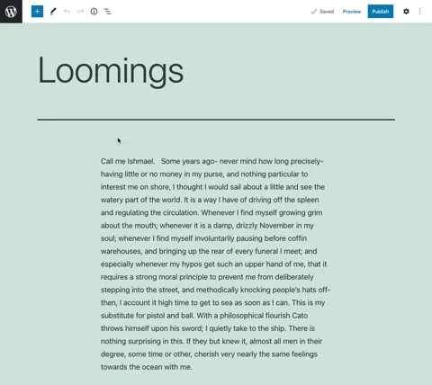

# Insert Special Characters

> A Insert Special Characters for the WordPress block editor (Gutenberg).

   

## Overview

Ever wanted to add a special character while working within Gutenberg and suddenly find yourself longing for the days of the Classic Editor and the Special Character inserter?  Well long no more, the Insert Special Characters plugin is here to ease your publishing woes!

## Requirements

* PHP 5.4+
* [WordPress](http://wordpress.org/) 5.0+ ...or... WordPress 4.9 plus [Gutenberg 4.9](https://github.com/WordPress/gutenberg/releases/tag/v4.9.0)

## Installation

1. Install the plugin via the plugin installer, either by searching for it or uploading a .zip file.
1. Activate the plugin.
1. Use Insert Special Characters!

## Support Level

**Active:** 10up is actively working on this, and we expect to continue work for the foreseeable future including keeping tested up to the most recent version of WordPress.  Bug reports, feature requests, questions, and pull requests are welcome.

## Changelog

A complete listing of all notable changes to Insert Special Characters are documented in [CHANGELOG.md](https://github.com/10up/insert-special-characters/blob/master/CHANGELOG.md).

## Like what you see?

